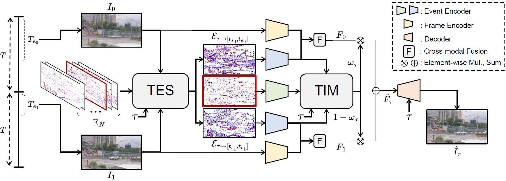

# Adaptive Feature Blending
Official PyTorch implementation of BMVC 2025 paper "Learning Event-guided Exposure-agnostic Video Frame Interpolation via Adaptive Feature Blending"

Codes will be released

---

## Abstract

Exposure-agnostic video frame interpolation (VFI) is a challenging task that aims to recover sharp, high-frame-rate videos from blurry, low-frame-rate inputs captured under unknown and dynamic exposure conditions. Event cameras are sensors with high temporal resolution, making them especially advantageous for this task. However, existing event-guided methods struggle to produce satisfactory results on severely low-frame-rate blurry videos due to the lack of temporal constraints. 

In this paper, we introduce a novel event-guided framework for exposure-agnostic VFI, addressing this limitation through two key components: a **Target-adaptive Event Sampling (TES)** and a **Target-adaptive Importance Mapping (TIM)**. 

* **TES** samples events around the target timestamp and the unknown exposure time to better align them with the corresponding blurry frames.
* **TIM** then generates an importance map that considers the temporal proximity and spatial relevance of consecutive features to the target. 

Guided by this map, our framework adaptively blends consecutive features, allowing temporally aligned features to serve as the primary cues while spatially relevant ones offer complementary support. Extensive experiments on both synthetic and real-world datasets demonstrate the effectiveness of our approach in exposure-agnostic VFI scenarios.

## Method Overview
